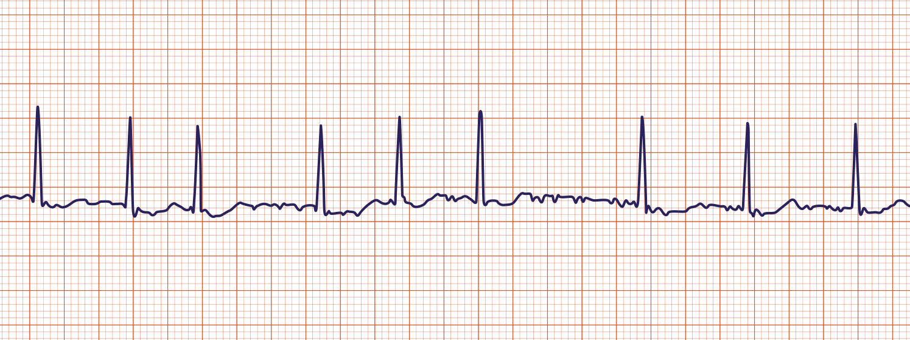

A rapid irregular atrial rhythm at 300-600 bpm. The AV node blocks most of these impulses and only responds intermittently (hence irregular QRS). Cardiac output is reduced by 10-20% as ventricles are not primed properly by atria

Main risk is from clots forming from pooling blood in atria leading to ischaemic [[Stroke]]

## Causes/Factors

**SMITH** pneumonic:
- [[Sepsis]] - [[pneumonia]]
- **M**itral valve pathology
- **I**schaemia - [[Coronary Artery Disease]]
- [[Hyperthyroidism|Thyrotoxicosis]]
- [[Essential hypertension|Hypertension]]

Lifestyle:
- Alcohol
- Caffeine 

## Symptoms

- Chest pain
- Palpitations
- Dyspnoea
- Syncope/pre-syncope
- May be asymptomatic

## Signs

- Irregularly irregular pulse
- 1st heart sound is of variable intensity
- Signs of underlying cause

## Diagnostic Tests

- ECG
  
- Blood: Thyroid function test
- Echo: look at valvular (mitral/aortic) and LV function

| Paroxysmal | Persistent | Permanent |
| ---- | ---- | ---- |
| Episodes lasting >30 seconds but <7 days (often less than 48 hours) | Episodes lasting >7 days | Longstanding >1 year |
| Self-terminating | Not self-terminating |  |
| Recurrent |  |  |

## Management

### Adverse features
Atrial fibrillation in patients with the follow should be defibrillated using synchronised DC cardioversion:
- Heart failure
- Myocardial ischaemia 
- Shock
- Syncope

![[z_attachments/Pasted image 20240131141429.png]]

## Paroxysmal AF
For intermittent short duration AF, "pill-in-the-pocket" strategy can be used. Patient can take a pharmacological cardioversion only when they feel symptoms of AF begin. 

Rate control - slows down the heart rate to prevent symptom of palpitations and improve heart beat efficiency

![[z_attachments/Pasted image 20240131141504.png]]

- $\beta$ blocker
- Calcium channel blockers (diltiazem, verapamil)
- Digoxin

Rhythm control - convert the hearth rhythm back into sinus rhythm

- Amiodarone
- Electric (DC) cardioversion

>[!info]
>Most common combination of drugs in AF is bisoprolol + apixaban

  _No real difference in prognosis between rate or rhythm control but rate is more common as better symptomatic improvement_

Anticoagulation - CHA$_2$DS$_2$-VASc score to determine whether to anticoagulate in AF. Do not withhold anticoagulation just on the basis of falls risk. 

**C**ongestive cardiac failure (1 point)
**H**ypertension (1)
**A**ge 65-74 (1)
**A**ge 74+ (2)
**D**iabetes (1)
**S**troke/TIA/thromboembolism (2)
**Va**scular disease (1)
**S**ex **C**ategory (1 if female)

A score of 2 = annual stroke risk of ~2-4%
3 = 3-6% risk

Increased chance of bleeding but bleeding is a better outcome than a stroke

**ORBIT** score used to predict risk of bleeding in AF

| Variable                                     | Points |
| -------------------------------------------- | ------ |
| Haemoglobin <130 g/L (M) <120g/L for females | 2      |
| Age >74 years                                | 1      |
| Bleeding history                             | 2      |
| Renal impairment (eGFR <60)                  | 1      |
| Treatment with antiplatelet agents           | 1      |
No formal rules on how to act on the ORBIT score but should be taken into account. 

|ORBIT score|Risk group|Bleeds per 100 patient-years|
|---|---|---|
|0-2|Low|2.4|
|3|Medium|4.7|
|4-7|High|8.1|