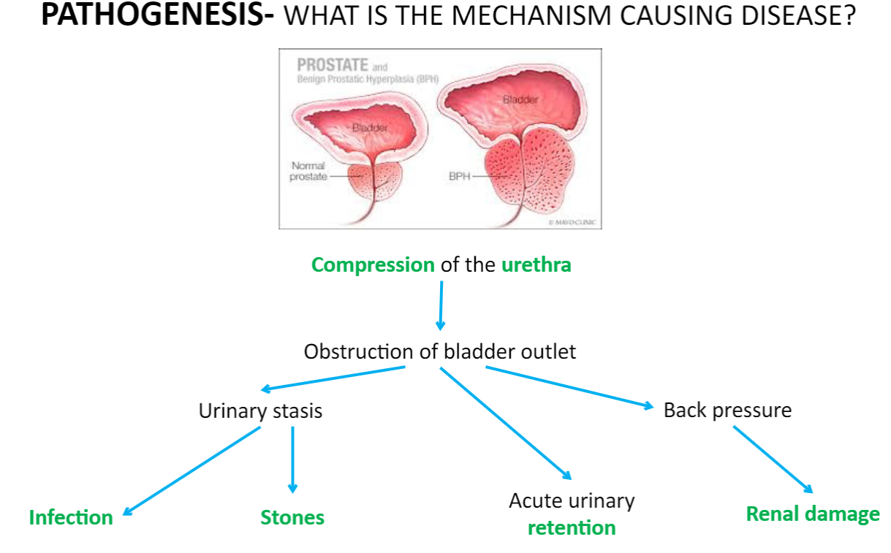

---
tags:
  - Urology
title: Benign Prostatic Hyperplasia
date created: Tuesday, August 1st 2023, 5:40:21 pm
date modified: 2024-03-11
date: 2024-03-11
---

Benign Prostatic Hyperplasia (BPH) is a non-cancerous enlargement of the prostate gland, which is located just below the bladder and surrounds the urethra. Increased number of both stromal and glandular cells in the prostate

## Causes/Factors

- Old men
- Obesity
- Diabetes
- FH
- Testosterone levels

## Symptoms

- Hesitancy
- Weak flow
- Urgency 
- Frequency 
- Intermittency
- Straining
- Terminal dribbling
- Incomplete emptying 
- Nocturia 
## Signs

- Smooth symmetrical, slightly soft enlarged prostate on **DRE**
- Abdominal mass - palpable bladder and other abnormalities 
## Diagnostic Tests

- **Digital Rectal Exam (DRE):** Examination of the prostate through the rectum to assess its size and texture.
- **Prostate-Specific Antigen (PSA) Test:** Blood test to measure PSA levels (elevated levels may indicate BPH or other prostate conditions).
- **Urinalysis:** To rule out urinary tract infections, haematuria and other pathology

> [!info] Prostate-specific antigen
> Known to be unreliable with a high rate of false positives (75%) and false negatives (15%). Common causes of raised PSA are:
> - Prostate cancer
> - BPH
> - Prostatitis
> - Urinary tract infections
> - Vigorous exercise (cycling especially)
> - Recent ejaculation or prostate stimulation

^a09e56

## Management

1. **Watchful Waiting:** For mild symptoms, regular monitoring without immediate treatment.
2. **Medications**:
	- alpha blockers - tamsulosin. Relax smooth muscle with rapid symptom improvement. Notable side effect of **postural hypotension**
	- 5-alpha reductase inhibitors - finasteride. Prevent the conversion of testosterone to DHT which is more potent. 6 months of treatment for effects to result in symptoms.
3. **Surgery**
	- Transurethral resection of prostate most common surgical treatment
	- *Others* - Transurethral electrovaporisation of the prostate (TEVAP/TUVP), holmium laser enucleation of the prostate (HoLEP), open prostatectomy

## Complications/red Flags

- **Urinary Retention:** Inability to urinate due to severe prostate enlargement.
- **Urinary Tract Infections:** Stagnant urine in the bladder can lead to infections.