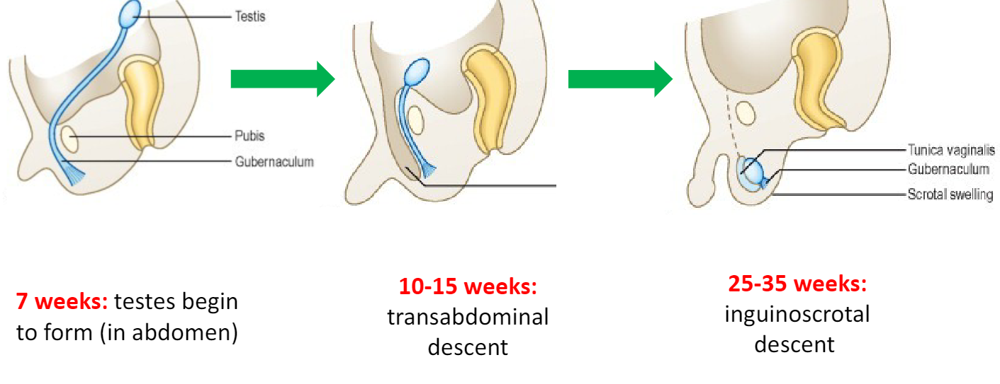

---
tags:
  - Urology
title: Cryptorchidism
date created: Tuesday, August 1st 2023, 5:40:21 pm
date modified: 2024-03-11
date: 2023-09-18
aliases:
  - Undescended testis
---

Testes develop in the abdomen and migrate down through the inguinal canal. In about 5% the testes have now made it out of the abdomen by birth. The longer the testes take to descend the less likely it is to happen spontaneously.

Many babies can be born within the 25-35 week window without testis decent

## Causes/Factors

- Family history
- Low birth weight
- Small gestational age
- Permaturity
- Maternal smoking during pregnancy

## Management

1. **Spontaneous Descent:** In some cases, testicles descend on their own within the first few months of life.
2. **Orchidopexy:** Surgical correction of the undescended testes. Carried out between 6 and 12 months 

> [!info]
> It is normal in boys that have not reached puberty for the testes to move out of the scrotum and into the inguinal canal when its cold or the **cremasteric reflex** is activated

## Complications/red Flags

- **Infertility:** Undescended testicles can impact sperm production and fertility.
- [[Seminoma]] regardless of whether it was surgically corrected  
- **Inguinal Hernias**
- **Testicular torsion**
