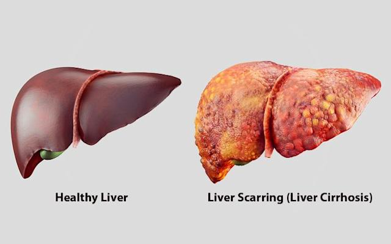

Irreversible scarring of the liver.

- Disturbed vascular perfusion

## Causes/Factors

- [[Alcohol-related Liver Disease]]
- [[Hepatitis#^b362b5]]
- [[Wilson's Disease]]
- [[Hemochromatosis]]
- [[Alpha-1 antitrypsin deficiency]]
- [[Non-alcoholic Fatty Liver Disease]]

## Symptoms

Portal [[Essential hypertension]] - Encephalopathy - [[Snippets/Ascites|Ascites]]

Hepatic failure - Coagulopathy - Encephalopathy - Hypoalbuminaemia

- Splenomegaly
- Bleeding tendency
- Endocrine abnormalities (oestogren not being broken down)
- Renal failure
- Hepatocellular carcinoma

## Signs

- [[Jaundice]]
- hetpatomegaly
- spider naevi
- [[Snippets/Ascites|Ascites]] ^e3cff3

## Diagnostic Tests

- Blood - LFT, $\uparrow$ bilirubin, $\uparrow$AST, $\uparrow$ALP, $\uparrow$GGT
- Liver ultrasound
- MRI
- Liver biopsy
- Ascitic tap

## Management

- Good nutrition, alcohol abstinence, avoid NSAIDs, sedatives and opiates
- [[Snippets/Ascites|Ascites]] - fluid restriction, low salt diet possible spiro
- **Liver transplant** - only definitive treatment

## Monitoring

6 monthly MELD score, USS, aPF (for carcinoma)

Endoscopy every 3 years for oesophageal varicies screening 

### MELD Score
- Model for End-Stage Liver Disease 
- Using LFTs gives an estimated 3 month mortality 
- Calculated **every 6 months**

### Child-Pugh Score
- Assesses the severity of [[Snippets/Cirrhosis|Cirrhosis]] and the prognosis
- **A** – **A**lbumin
- **B** – **B**ilirubin
- **C** – **C**lotting (INR)
- **D** – **D**ilation ([[Snippets/Ascites|Ascites]])
- **E** – **E**ncephalopathy

## Complications/red Flags

- Liver cancer - hepatocytes have to regenerate and repair over and over
- Portal [[Essential hypertension]] - [[oesophageal varices]]
- $\uparrow$ risk of infection - alterations in immune system

