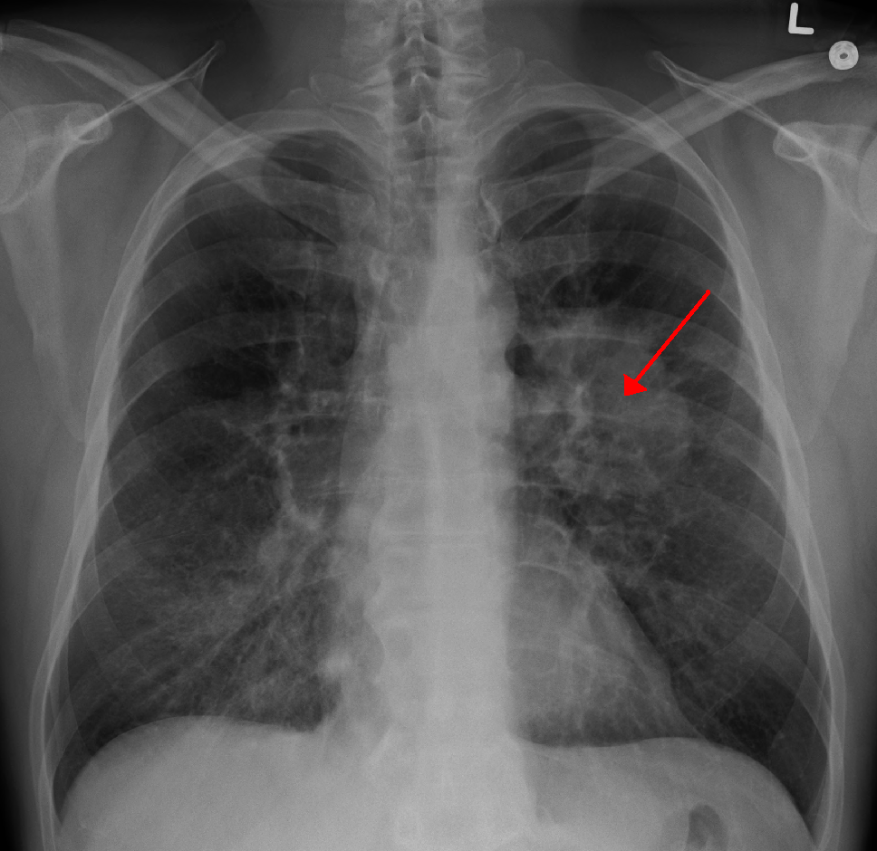

Carcinoma of the bronchus - second most common cancer in UK, only 5% cured

#### Primary lung tumours 
- 90% are carcinomas
- Non-small cell carcinoma 85%
    - **adenocarcinoma** 30% - mucin production
    - **[[Squamous cell carcinoma]]** 20% - presence of keratinization
    - large cell carcinoma 10%
- **Small cell** 15% - arise from endocrine cells -> excrete peptides -> [[Snippets/Paraneoplastic Syndromes|Paraneoplastic Syndromes]]

Main morphological difference between the two is nuclear characteristics and amount of cytoplasm. Small cell "always" smoking
#### Secondary Lung Tumours
- More common than primary
- Multiple discrete nodules
- Most commonly from breast, GIT, kidney
- Sarcomas
- Melanomas
- Lymphomas

## Causes/Factors

- Smoking (90%)
- asbestos
- chromium
- arsenic
- iron oxides
- radon gas
## Symptoms

- cough
- haemoptysis
- dyspnoea
- chest pain
- weight loss

**Small cell**  
- ADH
- ACTH - not typical, [[Essential hypertension]], hyperglycaemia, hypokalaemia, alkalosis and muscle weakness are more common than buffalo hump etc
- [Lambert-Eaton syndrome](https://www.nosos.co.uk/snippets/lamberteaton-syndrome/)

  
**Squamous cell**  
- parathyroid hormone-related protein (PTH-rp) secretion causing **[[Snippets/Hypercalcaemia|Hypercalcaemia]]**
- [[clubbing]]
- hypertrophic pulmonary osteoarthropathy (HPOA)
- [[Snippets/Hyperthyroidism|Hyperthyroidism]] due to ectopic TSH

  
**Adenocarcinoma**  
- gynaecomastia
- hypertrophic pulmonary osteoarthropathy (HPOA)

## Signs

- **[[clubbing]]** of fingers
- [[Snippets/Anaemia|Anaemia]]
- [[Pleural Effusion]]
- hepatomegaly
- metastasis - lymphadenopathy

## Diagnostic Tests

- Made on histology (biopsy)
- Can see tumour of CXR
  

## Management

- Pemetrexed + (cisplatin) chemotherapy
- Surgery hard to evaluate
- Radiotherapy controversial

## Complications/red Flags

Poor prognosis in general

- phrenic + recurrent laryngeal nerve palsy (mass impinges)
- 
