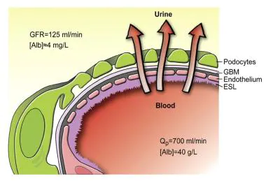
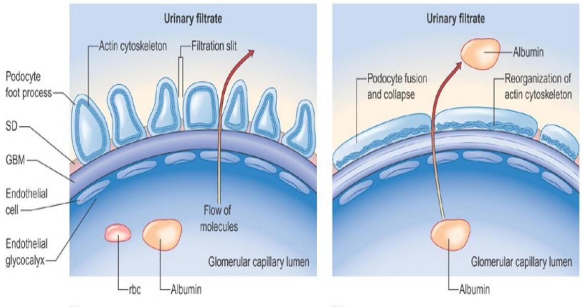

Loss of protein in urine

GBM has negative charge to repel proteins

(Left) Loss of negative charge

## Causes/Factors

- **[[Minimal change disease]]** - most common cause in children. Usually idiopathic and treated with steroids
- Membranous nephropathy - most common cause in adults
- Focal Segmental Glomerulosclerosis - most common cause in adults
- [[Diabetes Mellitus]]
- [[Systemic Lupus Erythematosus]]
- Amyloid

- [[HIV]], HEP B&C, malaria
- NSAIDs

> [!tip]
> Minimal change disease often comes up in exams. If there's a 2-5 year old child with oedema proteinuria and low albumin the diagnosis is likely nephrotic syndrome. 

## Symptoms

- Proteinuria
- Hypoalbuminaemia
- Oedema - ankles, feet, eyes (in severe)

- Hypercholesterolaemia

## Signs

- Peripheral oedema
- Frothy urine
- Weight gain
- Fatigue
- Loss of appetite

## Diagnostic Tests

- Urinalysis
- Blood tests
- Biopsy

## Management

Specific

- Steroids
- Cyclophosphamide, tacrolimus

- Loop diuretics furosemide
- BP control - ACEi
- Hypercholesterolaemia - statins
- Thrombo-prophylaxis - herparin

## Complications/red Flags

- Thrombosis - due to loss of blood blotting proteins
- High blood cholesterol and elevated blood triglycerides - live makes more albumin along with cholesterol and triglycerides
- Poor nutrition - loss of blood protein
- High BP
- [[Acute Kidney Injury]]
- [[Chronic Kidney Disease]]
- Infections
