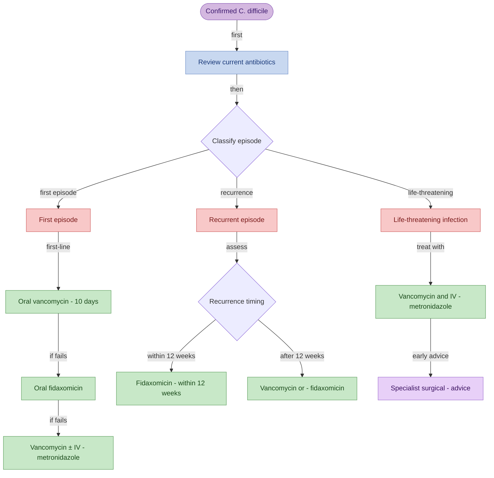

Gram-positive, rod-shaped anaerobe

Opportunistic when antibiotics remove other bacterial competition and can get out of control. Toxins produed - toxin A (enterotoxin) and toxin B (cytotoxin)

## The antibiotics most associated with C. diff start with the letter C:

* [[Pearls/Clindamycin|Clindamycin]]
* [[Pearls/Ciprofloxacin|Ciprofloxacin]] (and other fluoroquinolones)
* [[Full/Cephalosporins]]
* [[Full/Carbapenems]] (e.g., meropenem)

**PPIs are also a risk factor for *C. difficile* infection**

## Diagnosis

Diagnosis is based on stool samples. Stools can be tested for:

* C. diff antigien - only shows presence of C. diff not active infection. Screening test
* A and B toxins (PCR) - shows active infection

### Assessing Severity

White cell count is used to assess severity as it reflects the degree of the immune response. 

- Mild = normal white cell count
- Moderate = raised white cell count (but <15x10^9/L)
- Severe = raised white cell count >15x10^9/L

| Mild       | Moderate                                                       | Severe                                                                                                                                                                           | Life-threatening                                                                                  |
| ---------- | -------------------------------------------------------------- | -------------------------------------------------------------------------------------------------------------------------------------------------------------------------------- | ------------------------------------------------------------------------------------------------- |
| Normal WCC | ↑ WCC ( < 15 x 10^9/L)   Typically 3-5 loose stools per day | ↑ WCC ( > 15 x 10^9/L)   or an acutely ↑ creatinine (> 50% above baseline)   or a temperature > 38.5°C   or evidence of severe colitis(abdominal or radiological signs) | Hypotension   Partial or complete ileus   Toxic megacolon, or CT evidence of severe disease |

## Management

* Oral vancomycin 1st
* Oral fidaxomicin 2nd
* Oral vancomycin + IV metronidazole 3rd

Source isolated for 48 hrs after the last episode of diarrhoea. High recurrence rate. Foaecal microbiota transplant is an option for recurrent cases after 2 or more episodes

In **life-threatening** _C. difficile_ infection treatment is with ORAL vancomycin and IV metronidazole

#### Further episodes

- Relapse within 12 weeks - oral fidaxomicin
- Relapse after 12 weeks - oral vancomycin or oral fidaxomicin 

## Complications

### Pseudomembranous colitis

Inflammation in the large intestine with **yellow/white plaques** that form pseudomembranes on the inner surface of the bowel wall. Seen during a colonoscopy and confirmed with biopsies

### Toxic megacolon

Complication of severe inflammation in the large intestine and involves dilation of the colon. Patients are very unwell and have a high risk. Stop anti-motility drugs (e.g. codeine, loperamide) to reduce risk.

