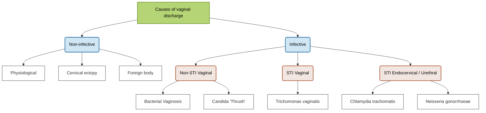

- [[Pearls/Cervical ectropion|Cervical ectropion]]
- [[Pearls/Bacterial vaginosis|Bacterial vaginosis]]
- [[Pearls/Vaginal candidiasis|Vaginal candidiasis]]
- [[Pearls/Trichomoniasis|Trichomoniasis]]
- [[Pearls/Chlamydia|Chlamydia]]
- [[Pearls/Gonorrhoea|Gonorrhoea]]