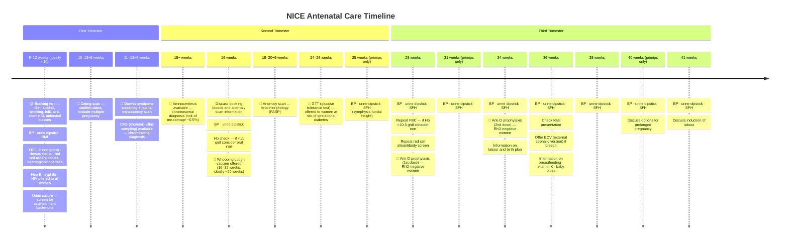

BP and urine dip and each appointment to screen for [[Full/Pre-eclampsia|Pre-eclampsia]]

- 10 antenatal visits in the first pregnancy if uncomplicated
- 7 antenatal visits in the subsequent pregnancies 

- 2 scans in low risk pregnancies
- 4ish scans for high risk 

Scans look at generally:
- Baby growth
- Liqor volume
- Location of placenta
- Placental blood flow

| **Gestation**                     | **Purpose of visit**                                                                                                                                                                                                                                                                                                                                                                                               |
| --------------------------------- | ------------------------------------------------------------------------------------------------------------------------------------------------------------------------------------------------------------------------------------------------------------------------------------------------------------------------------------------------------------------------------------------------------------------ |
| 8 - 12 weeks (ideally < 10 weeks) | **Booking visit**   - general information e.g. diet, alcohol, smoking, folic acid, vitamin D, antenatal classes - BP, urine dipstick, check BMI (no pelvic exam)  **Booking bloods/urine**   - FBC, blood group, rhesus status, red cell alloantibodies, haemoglobinopathies - hepatitis B, syphilis - HIV test is offered to all women - urine culture to detect asymptomatic bacteriuria |
| 10 - 13+6 weeks                   | Early scan to confirm dates, exclude multiple pregnancy                                                                                                                                                                                                                                                                                                                                                            |
| 11 - 13+6 weeks                   | [[Pearls/Down's syndrome\|Down's syndrome]] screening including nuchal scan                                                                                                                                                                                                                                                                                                                                        |
| 16 weeks                          | Information on the anomaly and the blood results. If Hb < 11 g/dl consider iron   Routine care: BP and urine dipstick                                                                                                                                                                                                                                                                                           |
| 18 - 20+6 weeks                   | **Anomaly scan**                                                                                                                                                                                                                                                                                                                                                                                                   |
| 25 weeks (only if primip)         | Routine care: BP, urine dipstick, symphysis-fundal height (SFH)                                                                                                                                                                                                                                                                                                                                                    |
| 28 weeks                          | Routine care: BP, urine dipstick, SFH   Second screen for anaemia and atypical red cell alloantibodies. If Hb < 10.5 g/dl consider iron   **First dose of anti-D prophylaxis to rhesus negative women**                                                                                                                                                                                                      |
| 31 weeks (only if primip)         | Routine care as above                                                                                                                                                                                                                                                                                                                                                                                              |
| 34 weeks                          | Routine care as above   **Second dose of anti-D prophylaxis to rhesus negative women** Information on labour and birth plan                                                                                                                                                                                                                                                                                  |
| 36 weeks                          | Routine care as above   Check presentation - offer external cephalic version if indicated   Information on breast feeding, vitamin K, 'baby-blues'                                                                                                                                                                                                                                                           |
| 38 weeks                          | Routine care as above                                                                                                                                                                                                                                                                                                                                                                                              |
| 40 weeks (only if primip)         | Routine care as above   Discussion about options for prolonged pregnancy                                                                                                                                                                                                                                                                                                                                        |
| 41 weeks                          | Routine care as above   Discuss labour plans and possibility of induction                                                                                                                                                                                                                                                                                                                                       |

#### Combined Screening

- Opt-in test
- Informed consent needed
- Done from 11+2 to 14+1

1. Dates the pregnancy by crown-rump length
2. Checks for nuchal translucency
3. Gets maternal bloods to look for hCG and PAPPA (see [[Pearls/Down's syndrome|Down's syndrome]])

##### Definitive diagnostics

- (NIPT)
- Chorionic villus sampling 11-13 weeks
- Amniocentesis 15+ weeks

#### Vaccines

- Whooping cough (pertussis) from 16 weeks gestation
- Influenza when available in autumn or winter