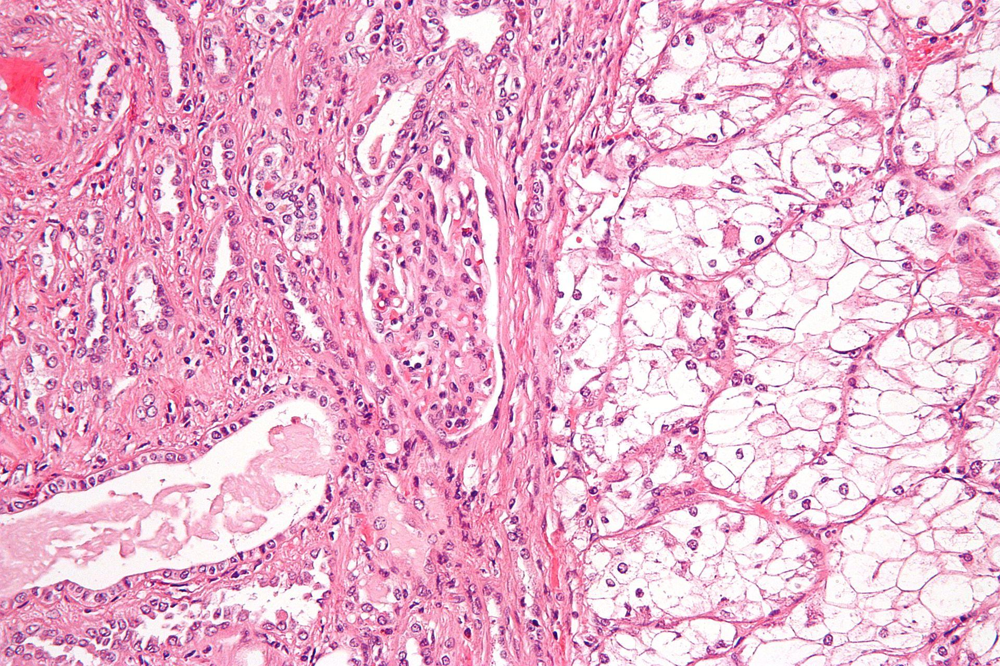
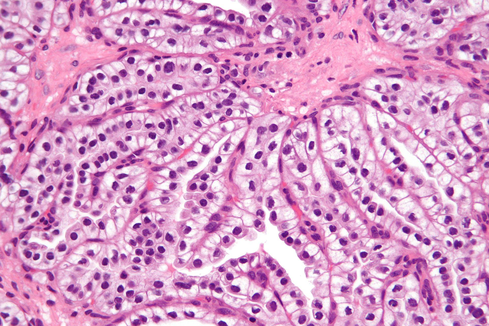

Cancer of the kidney that arises from the renal tubular epithelium

Two most common:

- Clear cell (75%)
  

- Papillary (10%)
  

## Causes/Factors

- Age (60+)
- Male
- Obesity
- Smoking
- NSAID use
- ESRF and on dialysis

- Family history (esp Von Hippel-Lindau)

## Clinical Features

###### Local Primary Tumour Effects

- Haematuria
- Abdominal pain

###### Effects of Distant Metastases

- Lung mets -> SOB
- Bone mets -> bone pain

###### Paraneoplastic Syndromes

- Weight loss "cancer cachexia"
- [[Essential hypertension|Hypertension]]
- Polycythaemia

## Diagnostic Tests

## Management

## Complications/red Flags
