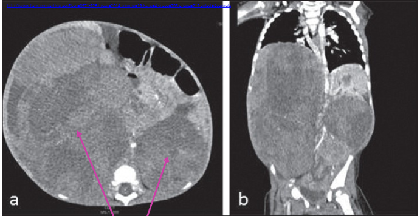

Cancer of the kidney that arises from nephroblasts (cells that develop into the kidney in embryological development)

## Causes/Factors

- Children < 5 y/o
- 5-10% genetic syndromes
  - Beckwith-Weidemann Syndrome
  - WAGR Syndrome
  - Denys-Drash Syndrome (WT1 mutation)

## Clinical Features

###### Local Primary Tumour Effects

- +++ Abdominal distention
- Haematuria
- 10% bilateral

###### Effects of Distant Metastases

Rare

###### Paraneoplastic Syndromes

Rare

## Diagnostic Tests

## Management

- 90% 5YSR

## Complications/red Flags
