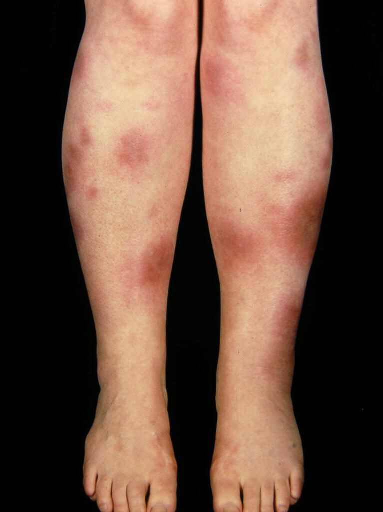

> [!info] 
Erythema nodosum is **swollen fat under the skin causing bumps and patches that look red or darker than surrounding skin**. It usually goes away by itself, but it can be a sign of something serious - _NHS website_

