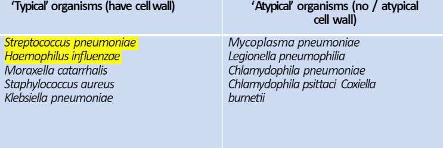

---
tags:
  - Respiratory
title: pneumonia
date created: Tuesday, August 1st 2023, 5:40:21 pm
date modified: 2024-03-11
aliases:
  - Pneumonia
date: 2024-01-14
---

An acute lower respiratory tract infection associated with fever and other abnormal chest symptoms and signs

## Causes/Factors

- Community acquired (CAP) - most common streptococcus pneumoniae. Occurring outside of hospital or within 48hr of admission
  
  
### **CURB-65** - one point for each
- Confusion - AMTS $\leq$ 8 
- Urea - >7 mmol/L
- RR - $\geq$ 30
- Blood pressure < 90 systolic or <60 diastolic
- Age $\geq$ 65 (soft score)

0-1 - low risk home management - 500mg amoxicillin TDS for 5 days
2 - intermediate risk - short in-patient stay
$\geq$ 3 - high risk - severe pneumonia

#### Risk of death with CURB-65

|Score|Risk of death at 30 days|
|---|---|
|0|0.7%|
|1|3.2%|
|2|13.0%|
|3|17.0%|
|4|41.5%|
|5|57.0%|

---

- Hospital acquired (HAP) - after 48hs from admission
- Ventilator associated (VAP)
- Asp iration pneumonia

- Immunocompromised patient - patients recurrently coming with a CAP is an indicator of HIV - esp if organism is weird

## Symptoms

- Fever
- Rigors
- Anorexia
- Dyspnoea
- Productive cough
- Pleural pain

## Signs

- Pyrexia
- Cyanosis
- Confusion - may be only sign in elderly patients
- Tachypnoea
- Tachycardia
- Hypotension
- Hypoxia
- Bronchial breathing (harsh breath sounds) and crackles heard

## Diagnostic Tests

- CXR: showing consolidation
- Blood/sputum culture
- Bronchoscopy if risk of infection for bloods

- U&Es - hyponatremia pneumonia $\rightarrow$ legionella. Can also use urinary antigen very sensitive and specific for legionella
- Pet history - parrots $\rightarrow$ Chlymidia pneumonitis
- Weird rash $\rightarrow$ Mycoplasma

## Management

ABCDE
- Fluids
- Oxygen
- Antibiotics
- Assisted ventilation

## Complications/red Flags

- Type 1 [[Respiratory Failure]] ($PaO_2 < 8kPa$)
- Hypotension <- vasodilation/dehydration <- sepsis
- [[Atrial Fibrillation]] - common in elderly, usually resolves with treatment
- [[Pleural Effusion]] - inflammation of pleura leading to fluid build up
- [[Empyema]] - pus in pleural space, should be drained with chest drain
- [[Lung Abscess]]
- [[Pericarditis]] and [[myocarditis]]
- [[Jaundice]] - usually cholestatic - may be due to sepsis or secondary to antibiotic treatment (esp. flucloxacillin and co-amoxiclav)
