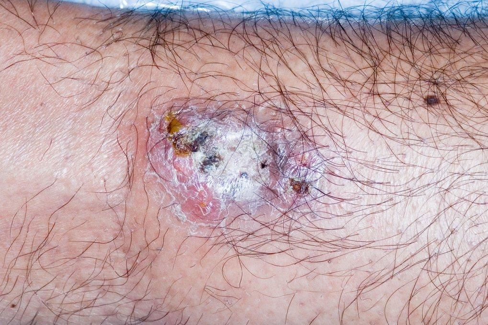

---
tags:
  - Dermatology
title: pyoderma gangrenosum
date created: Tuesday, August 1st 2023, 5:40:21 pm
date modified: 2024-03-11
date: 2023-09-18
---
Pyoderma gangrenosum is a rare skin condition that causes rapidly enlarging, painful ulcers. It's usually treatable but can take some time to heal and may leave some scarring. Inflammatory ulcer

## Causes/Factors

- [[inflammatory bowel disease]]
- [[Inflammatory Arthritis]]
- Other autoimmune conditions
